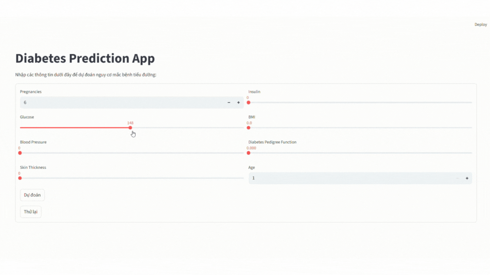

# Diabetes Prediction Web Application

This repository hosts a machine learning project designed to predict the risk of diabetes based on various health parameters. It includes a robust model training pipeline and a user-friendly web interface built with Streamlit, allowing users to input their health data and receive real-time predictions.


## Features

*   **Data Handling**: Loading, splitting (training/testing), and preprocessing of the diabetes dataset.
*   **Feature Scaling**: Utilizes `StandardScaler` for normalizing input features to improve model performance.
*   **Missing Value Imputation**: Handles missing values implicitly (e.g., through `SimpleImputer` in the training script).
*   **Model Training**: Supports training multiple classification models including Support Vector Classifier (SVC), Decision Tree, Random Forest, and leverages `LazyClassifier` for automated model selection and evaluation.
*   **Model Evaluation**: Provides classification reports to assess model performance (precision, recall, f1-score).
*   **Model Persistence**: Trained machine learning models and `StandardScaler` objects are serialized using `pickle` for efficient loading and deployment.
*   **Interactive Web Application**: A user-friendly web interface built with Streamlit for easy data input.
*   **Real-time Prediction**: Generates instantaneous diabetes risk predictions based on user-provided health features.
*   **Form Reset**: Functionality to clear input fields in the web application for new predictions.

## Installation

To set up and run this project locally, follow these steps:

1.  **Clone the repository:**
    ```bash
    git clone https://github.com/vanhdev-web/Diabetes-Prediction.git
    cd Diabetes-Prediction
    ```

2.  **Create a virtual environment (recommended):**
    ```bash
    python -m venv venv
    # On Windows
    venv\Scripts\activate
    # On macOS/Linux
    source venv/bin/activate
    ```

3.  **Install the required Python packages:**
    ```bash
    pip install streamlit pandas scikit-learn numpy lazypredict
    ```

## Usage

This project workflow involves two main steps: first, training the machine learning model (if not already trained or if you wish to retrain), and then running the interactive web application.

1.  **Train the Machine Learning Model:**
    The `diabetes.py` script handles data preprocessing, model training, and saving the trained model and scaler. You only need to run this once or if you want to retrain the model.
    ```bash
    python diabetes.py
    ```
    This script will generate `diabetes_model.pkl` (the trained classification model) and `scaler.pkl` (the fitted `StandardScaler` object) in your project directory.

2.  **Run the Diabetes Prediction Web Application:**
    Once the `diabetes_model.pkl` and `scaler.pkl` files are available, you can launch the Streamlit web application.
    ```bash
    streamlit run app.py
    ```
    This command will open the application in your default web browser (typically at `http://localhost:8501`). You can then input various health parameters and receive a real-time prediction of diabetes risk.

## Tech Stack

*   **Language**: Python
*   **Web Framework**: Streamlit
*   **Machine Learning Libraries**:
    *   scikit-learn
    *   Pandas
    *   NumPy
    *   LazyPredict

## Project Structure

```
.
├── app.py                     # Streamlit web application for real-time diabetes prediction
├── diabetes.py                # Script for data loading, preprocessing, model training, and saving
├── diabetes (1).csv           # The dataset used for training the diabetes prediction model
├── diabetes_model.pkl         # Serialized (pickled) trained machine learning model
├── scaler.pkl                 # Serialized (pickled) StandardScaler object used for feature scaling
├── diabetes_report.html       # (Optional) HTML report, potentially generated during model training/evaluation
└── README.md                  # This README file providing project overview and instructions
```

## Contributing

Contributions are welcome! If you have suggestions for improvements, bug fixes, or new features, please feel free to:

1.  Fork the repository.
2.  Create a new branch (`git checkout -b feature/YourFeature`).
3.  Make your changes.
4.  Commit your changes (`git commit -m 'Add some feature'`).
5.  Push to the branch (`git push origin feature/YourFeature`).
6.  Open a Pull Request.

## License

This project is licensed under the MIT License.


